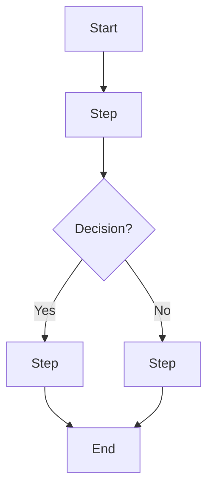

# Process Map: [Process Name]

## Process Diagram

```mermaid
flowchart TD
    A[Start] --> B[Step]
    B --> C{Decision?}
    C -->|Yes| D[Step]
    C -->|No| E[Step]
    D --> F[End]
    E --> F
```

## Step List

1. [Step description] (Actor: [who performs it])
2. [Step description] (Actor: [who performs it])
