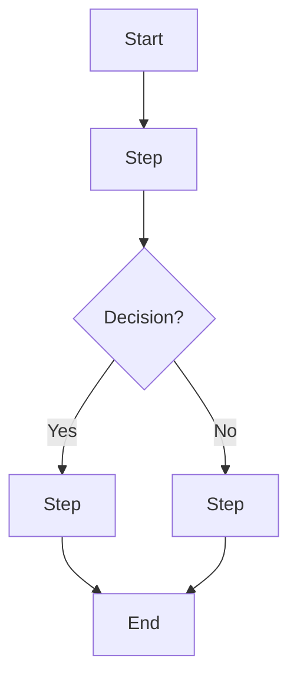

# Business Analyst Skills Implementation Plan

> **For agentic workers:** REQUIRED SUB-SKILL: Use superpowers:subagent-driven-development (recommended) or superpowers:executing-plans to implement this plan task-by-task. Steps use checkbox (`- [ ]`) syntax for tracking.

**Goal:** Build the `business-analyst` plugin: three composable Claude skills (interview synthesis, user story writing, process mapping) that let a non-technical Business Analyst turn raw interview/requirement/process input into structured Markdown deliverables.

**Architecture:** One plugin directory holding three independently-triggerable `SKILL.md` files plus shared `templates/` and `references/ba-glossary.md` files that all three skills read by relative path. No shared code/logic beyond the templates — each skill is a self-contained instruction set. There is no automated test framework; each skill is validated by a manual dry-run against a sample fixture, checked against a required-sections checklist.

**Tech Stack:** Markdown-only (SKILL.md instruction files, Markdown templates, Mermaid for diagrams). No application code, no build step, no package manager.

**Spec:** `docs/superpowers/specs/2026-08-24-business-analyst-skills-design.md`

## Global Constraints

- Skills must be platform-agnostic: usable from claude.ai (web/desktop) or Claude Code CLI. No CLI-only/Bash-only hard requirements in skill instructions.
- Output format is Markdown only. No format conversion (Word/PowerPoint/Confluence) — explicitly out of scope.
- Each skill must proactively ask 1-3 targeted clarifying questions when input is ambiguous or missing required detail, before producing output — never silently guess on material gaps.
- Each skill must confirm output filename/location with the user before writing the file.
- Empty/unusable input: skill states this plainly and asks for input again — no silent guessing.
- Partially usable input: proceed with what's readable, flag gaps inline as `[UNCLEAR: ...]`.
- `ba-user-story-writer` and `ba-process-mapper` must each accept EITHER a findings-doc (chained from `ba-interview-synthesis`) OR raw/ad-hoc text (standalone) — no hard dependency between skills.
- User story format: standard Agile "As a [role], I want [goal], so that [benefit]" plus Given/When/Then acceptance criteria.
- Process map output: both a Mermaid flowchart AND a plain-text numbered step list, in the same file.

---

### Task 1: Plugin scaffold — manifest, shared templates, glossary

**Files:**
- Create: `business-analyst/plugin.json`
- Create: `business-analyst/templates/findings-doc.md`
- Create: `business-analyst/templates/user-story.md`
- Create: `business-analyst/templates/process-map.md`
- Create: `business-analyst/references/ba-glossary.md`
- Test: `business-analyst/samples/` (fixture directory used by later tasks' dry-run tests)

**Interfaces:**
- Produces: `templates/findings-doc.md` — section headers `## Pain Points`, `## Requirements`, `## Decisions Made`, `## Open Questions / Risks`, `## Stakeholder Concern Matrix` (table columns: Stakeholder | Concern/Need | Priority). Consumed by Task 2.
- Produces: `templates/user-story.md` — section headers `## Story` (As a/I want/so that block) and `## Acceptance Criteria` (Given/When/Then list). Consumed by Task 3.
- Produces: `templates/process-map.md` — section headers `## Process Diagram` (fenced ` ```mermaid ` block) and `## Step List` (numbered list). Consumed by Task 4.
- Produces: `references/ba-glossary.md` — plain-language definitions of BA terms used across all three skills (e.g. "stakeholder", "acceptance criteria", "swimlane", "requirement" vs "user story"). Consumed by Tasks 2-4 (referenced, not duplicated).

- [ ] **Step 1: Create plugin manifest**

Create `business-analyst/plugin.json`:

```json
{
  "name": "business-analyst",
  "description": "Skills that help Business Analysts turn stakeholder interviews, requirements, and process descriptions into structured deliverables: findings documents, Agile user stories, and process maps.",
  "version": "0.1.0",
  "skills": [
    "skills/ba-interview-synthesis",
    "skills/ba-user-story-writer",
    "skills/ba-process-mapper"
  ]
}
```

- [ ] **Step 2: Create the findings-doc template**

Create `business-analyst/templates/findings-doc.md`:

```markdown
# Stakeholder Interview Findings: [Interview Subject / Meeting Title]

**Date:** [interview date]
**Participants:** [list of stakeholders present]
**Synthesized:** [date this doc was generated]

## Pain Points

- [Pain point, attributed to speaker if known]

## Requirements

- [Requirement statement, phrased as a need, not a solution]

## Decisions Made

- [Decision, and who made it, if stated]

## Open Questions / Risks

- [Open question or risk raised but not resolved in the interview]

## Stakeholder Concern Matrix

| Stakeholder | Concern/Need | Priority |
|---|---|---|
| [Name/Role] | [Concern] | [High/Medium/Low] |
```

- [ ] **Step 3: Create the user-story template**

Create `business-analyst/templates/user-story.md`:

```markdown
## Story: [Short story title]

As a [role],
I want [goal],
so that [benefit].

## Acceptance Criteria

- **Given** [initial context], **When** [action taken], **Then** [expected outcome].
- **Given** [initial context], **When** [action taken], **Then** [expected outcome].
```

- [ ] **Step 4: Create the process-map template**

Create `business-analyst/templates/process-map.md`:

```markdown
# Process Map: [Process Name]

## Process Diagram



## Step List

1. [Step description] (Actor: [who performs it])
2. [Step description] (Actor: [who performs it])
```

- [ ] **Step 5: Create the shared BA glossary**

Create `business-analyst/references/ba-glossary.md`:

```markdown
# Business Analyst Glossary

Plain-language definitions used consistently across the ba-interview-synthesis,
ba-user-story-writer, and ba-process-mapper skills. Skills reference this file
rather than redefining these terms.

- **Stakeholder** — anyone with an interest in or influence over the outcome
  (e.g. a department head, an end user, a sponsor).
- **Requirement** — a stated need the solution must satisfy, phrased as "the
  system/process must..." — not a specific solution or implementation.
- **User story** — a short description of a feature from the perspective of
  the person who wants it, in the form "As a [role], I want [goal], so that
  [benefit]".
- **Acceptance criteria** — the specific, testable conditions a user story
  must meet to be considered done, written as Given/When/Then statements.
- **Swimlane** — a way of grouping process steps by which actor/role performs
  them, so responsibility is visible at a glance.
- **Pain point** — a specific problem or frustration a stakeholder describes
  with the current state.
```

- [ ] **Step 6: Create the samples fixture directory placeholder**

Create `business-analyst/samples/.gitkeep` (empty file) so the directory exists for later tasks' sample fixtures.

- [ ] **Step 7: Verify scaffold**

Run:

```bash
find /Volumes/BigBadDrive_1/BigBadWizardry/business-analyst -type f | sort
```

Expected output includes exactly:
```
.../business-analyst/plugin.json
.../business-analyst/references/ba-glossary.md
.../business-analyst/samples/.gitkeep
.../business-analyst/templates/findings-doc.md
.../business-analyst/templates/process-map.md
.../business-analyst/templates/user-story.md
```
(skills/ subdirectories will appear empty until Tasks 2-4 add SKILL.md files — that's expected at this point.)

- [ ] **Step 8: Commit**

```bash
cd /Volumes/BigBadDrive_1/BigBadWizardry
git init
git add business-analyst docs
git commit -m "chore: scaffold business-analyst plugin (manifest, templates, glossary)"
```

---

### Task 2: ba-interview-synthesis skill

**Files:**
- Create: `business-analyst/skills/ba-interview-synthesis/SKILL.md`
- Create: `business-analyst/samples/sample-interview-transcript.md` (test fixture)
- Test: manual dry-run (no automated harness — see Step 3 below)

**Interfaces:**
- Consumes: `business-analyst/templates/findings-doc.md` (Task 1), `business-analyst/references/ba-glossary.md` (Task 1).
- Produces: a findings-doc-shaped Markdown file, consumed as optional input by `ba-user-story-writer` (Task 3) and `ba-process-mapper` (Task 4).

- [ ] **Step 1: Write the SKILL.md**

Create `business-analyst/skills/ba-interview-synthesis/SKILL.md`:

```markdown
---
name: ba-interview-synthesis
description: Turn a stakeholder interview transcript (pasted text or an uploaded file containing text and/or images) into a structured findings document — pain points, requirements, decisions, open questions, and a stakeholder concern matrix. Use when a Business Analyst has a raw interview transcript and needs it turned into an organized, shareable findings doc.
---

# Stakeholder Interview Synthesis

Turns a raw stakeholder interview transcript into a structured findings document, using
`../../templates/findings-doc.md` as the output shape and `../../references/ba-glossary.md`
for consistent terminology.

## When to use this skill

The user has a stakeholder interview transcript — pasted as text, or uploaded as a file
that may contain text and/or images (e.g. a scanned page, a screenshot of notes) — and
wants it turned into an organized findings document.

## Process

1. **Get the transcript.** Accept it as pasted text or an uploaded file. If no transcript
   has been provided yet, ask for it.

2. **Check for gaps before extracting.** Before producing output, check whether:
   - Speaker roles/identities are clear (who said what, and their role/title).
   - The interview's purpose/topic is clear.
   - Any section of the transcript is illegible, cut off, or ambiguous in a way that would
     materially change the findings.

   If 1-3 of these are unclear in a way that would change the output, ask targeted
   clarifying questions before proceeding — do not guess at material gaps. If the
   transcript is otherwise clear, proceed without asking.

3. **Extract findings into the template shape** (see `../../templates/findings-doc.md`):
   - **Pain Points** — problems/frustrations stakeholders described with the current state.
     Attribute to the speaker when known.
   - **Requirements** — needs stated as "the system/process must...", not as proposed
     solutions. See the glossary's Requirement definition.
   - **Decisions Made** — any decision stated in the transcript, and who made it if named.
   - **Open Questions / Risks** — anything raised but not resolved in the conversation.
   - **Stakeholder Concern Matrix** — a table of Stakeholder | Concern/Need | Priority.
     Infer priority from emphasis/urgency language in the transcript; if genuinely
     unclear, mark it `[UNCLEAR: priority not stated]` rather than guessing.

4. **Handle partial/illegible input.** If part of the transcript (e.g. an image with
   unreadable text) can't be read, extract everything else normally and mark the gap
   inline as `[UNCLEAR: ...]` in the relevant section — don't drop it silently, and don't
   let one bad section block the rest of the output.

5. **Confirm output filename before writing.** Propose a filename (e.g.
   `findings-<topic>-<date>.md`) and confirm with the user, then write the file using
   `../../templates/findings-doc.md` as the structural template.

## Output

A single Markdown file matching the structure of `../../templates/findings-doc.md`, filled
in with content extracted from the transcript.
```

- [ ] **Step 2: Create a sample transcript fixture for dry-run testing**

Create `business-analyst/samples/sample-interview-transcript.md`:

```markdown
# Sample Interview Transcript (test fixture)

**Interview:** Expense Reporting Process
**Date:** 2026-08-10
**Participants:** Maria Chen (Finance Manager), Tom Reyes (BA)

Tom: Can you walk me through how expense reports get submitted today?

Maria: Sure. Employees fill out a spreadsheet and email it to their manager. The manager
has to manually check receipts against the spreadsheet, which takes forever — honestly
it's the most annoying part of my week. We really need this to be faster, ideally under
five minutes per report.

Tom: What happens after the manager approves it?

Maria: They forward the email to Accounts Payable, who re-enter everything into our
accounting system by hand. That's where most of our errors come from — someone mistypes
an amount maybe once a week.

Tom: Is there anything about the current process that works well and shouldn't change?

Maria: The manager approval step itself is fine, we just need the data entry part fixed.
Also, whatever we build has to still let managers approve from their phone — a lot of
them travel.

Tom: Who else should I talk to about this?

Maria: Definitely talk to Dev Patel in Accounts Payable, he owns the re-entry step and
has strong opinions about it.
```

- [ ] **Step 3: Manual dry-run test**

Run Claude (via claude.ai or Claude Code, with the `business-analyst` plugin loaded) and
invoke the `ba-interview-synthesis` skill with
`business-analyst/samples/sample-interview-transcript.md` as input.

Verify the produced output file:
- Contains all five required section headers: `## Pain Points`, `## Requirements`,
  `## Decisions Made`, `## Open Questions / Risks`, `## Stakeholder Concern Matrix`.
- Pain Points includes the manual receipt-checking pain point.
- Requirements includes something about faster processing (e.g. under 5 minutes) and
  reducing manual re-entry errors.
- Stakeholder Concern Matrix includes at least Maria Chen as a row.
- Open Questions / Risks reasonably includes following up with Dev Patel, or the skill
  asked a clarifying question about him first — either is acceptable.
- No unexplained jargon; a non-technical reader could follow the whole document.

If any check fails, revise `SKILL.md`'s Process section and re-run this step.

- [ ] **Step 4: Commit**

```bash
cd /Volumes/BigBadDrive_1/BigBadWizardry
git add business-analyst/skills/ba-interview-synthesis business-analyst/samples/sample-interview-transcript.md
git commit -m "feat: add ba-interview-synthesis skill"
```

---

### Task 3: ba-user-story-writer skill

**Files:**
- Create: `business-analyst/skills/ba-user-story-writer/SKILL.md`
- Create: `business-analyst/samples/sample-requirements.md` (test fixture, standalone-input case)
- Test: manual dry-run (two cases — see Step 3 below)

**Interfaces:**
- Consumes: `business-analyst/templates/user-story.md` (Task 1), `business-analyst/references/ba-glossary.md` (Task 1), optionally a findings-doc produced by Task 2's skill.
- Produces: a Markdown file of one or more user stories, per `templates/user-story.md`'s shape.

- [ ] **Step 1: Write the SKILL.md**

Create `business-analyst/skills/ba-user-story-writer/SKILL.md`:

```markdown
---
name: ba-user-story-writer
description: Turn requirements — from a findings document or raw/ad-hoc requirement text — into Agile user stories with Given/When/Then acceptance criteria. Use when a Business Analyst needs requirements turned into properly formatted user stories, whether or not they already have a findings document.
---

# User Story Writer

Turns requirements into Agile user stories, using `../../templates/user-story.md` as the
output shape and `../../references/ba-glossary.md` for consistent terminology.

## When to use this skill

The user has requirements — either a findings document (e.g. one produced by the
`ba-interview-synthesis` skill) or raw/ad-hoc requirement text pasted directly — and wants
them turned into Agile user stories with acceptance criteria. Both input types are
supported; a findings document is not required.

## Process

1. **Get the requirements.** Accept either:
   - A findings document (look for its `## Requirements` section), or
   - Raw requirement text pasted directly, in any form (bullet list, prose, etc).

   If neither has been provided, ask for it.

2. **Check for gaps per requirement before writing stories.** For each requirement, check
   whether it's clear who the actor/role is, what the goal is, and what benefit it serves.
   If any of these are missing or ambiguous for a requirement, ask a targeted clarifying
   question before writing that story — do not invent an actor or benefit that wasn't
   implied by the input. Batch clarifying questions (ask up to 3 at once across all
   requirements) rather than asking one at a time per requirement.

3. **Write one story per requirement**, using `../../templates/user-story.md`'s shape:
   - `As a [role], I want [goal], so that [benefit].`
   - 2+ Given/When/Then acceptance criteria per story, covering at minimum the main
     success path. Add a second criterion for an edge case or failure path when the
     requirement implies one (e.g. validation, an error state).

4. **Handle unclear acceptance criteria.** If the requirement doesn't give enough detail
   to write a meaningful acceptance criterion (beyond what a clarifying question already
   resolved), mark it `[UNCLEAR: acceptance criteria needs BA input]` rather than
   inventing specific business rules.

5. **Confirm output filename before writing.** Propose a filename (e.g.
   `user-stories-<topic>-<date>.md`) and confirm with the user, then write all stories to
   one Markdown file, each following `../../templates/user-story.md`'s structure.

## Output

A single Markdown file containing one or more user stories, each matching the structure of
`../../templates/user-story.md`.
```

- [ ] **Step 2: Create a sample raw-requirements fixture for the standalone-input dry run**

Create `business-analyst/samples/sample-requirements.md`:

```markdown
# Sample Raw Requirements (test fixture)

- Managers need to be able to approve expense reports from their phone.
- Accounts Payable staff should not have to manually re-type expense amounts into the
  accounting system — data should flow through automatically.
- Employees want expense report submission to take under five minutes.
```

- [ ] **Step 3: Manual dry-run test — two cases**

**Case A (chained):** Invoke `ba-user-story-writer` with the findings doc produced in
Task 2's dry run (from `sample-interview-transcript.md`) as input.

**Case B (standalone):** Invoke `ba-user-story-writer` with
`business-analyst/samples/sample-requirements.md` as input directly.

For both cases, verify the output file:
- Each story has `As a [role], I want [goal], so that [benefit]` filled in (no bracket
  placeholders left over).
- Each story has at least 2 Given/When/Then acceptance criteria.
- The phone-approval requirement and the manual-re-entry requirement each produced a
  distinct story.
- No unexplained jargon.

If any check fails, revise `SKILL.md`'s Process section and re-run this step.

- [ ] **Step 4: Commit**

```bash
cd /Volumes/BigBadDrive_1/BigBadWizardry
git add business-analyst/skills/ba-user-story-writer business-analyst/samples/sample-requirements.md
git commit -m "feat: add ba-user-story-writer skill"
```

---

### Task 4: ba-process-mapper skill

**Files:**
- Create: `business-analyst/skills/ba-process-mapper/SKILL.md`
- Create: `business-analyst/samples/sample-process-description.md` (test fixture, standalone-input case)
- Test: manual dry-run (two cases — see Step 3 below)

**Interfaces:**
- Consumes: `business-analyst/templates/process-map.md` (Task 1), `business-analyst/references/ba-glossary.md` (Task 1), optionally a findings-doc produced by Task 2's skill.
- Produces: a Markdown file containing a Mermaid flowchart and a text step list, per `templates/process-map.md`'s shape.

- [ ] **Step 1: Write the SKILL.md**

Create `business-analyst/skills/ba-process-mapper/SKILL.md`:

```markdown
---
name: ba-process-mapper
description: Turn a process description — from a findings document or raw text — into a visual process map (Mermaid flowchart) plus a plain-text step list. Use when a Business Analyst needs a process turned into a diagram, whether or not they already have a findings document.
---

# Process Mapper

Turns a process description into a visual + text process map, using
`../../templates/process-map.md` as the output shape and `../../references/ba-glossary.md`
for consistent terminology.

## When to use this skill

The user has a description of a process — either a findings document (e.g. one produced
by the `ba-interview-synthesis` skill, which may describe a current-state process) or a
raw process description pasted directly — and wants it turned into a process map. Both
input types are supported; a findings document is not required.

## Process

1. **Get the process description.** Accept either a findings document or raw text
   describing a sequence of steps. If neither has been provided, ask for it.

2. **Check for gaps before mapping.** Before producing output, check whether:
   - The step order is clear (what happens first, next, last).
   - Any decision points/branches are identified (places where the process forks based
     on a condition).
   - Which actor/role performs each step is identifiable (for swimlane-style attribution
     in the step list).

   If any of these are unclear in a way that would change the shape of the map, ask
   targeted clarifying questions before proceeding — do not invent step order, branches,
   or actors that weren't stated or implied.

3. **Build the process map** using `../../templates/process-map.md`'s shape:
   - **Process Diagram** — a Mermaid `flowchart TD` (or `flowchart LR` if that reads
     better for the process's shape) with one node per step, decision nodes as `{...}`
     diamonds, and edges labeled for branch conditions (e.g. `-->|Yes|`).
   - **Step List** — the same process as a numbered plain-text list, each step annotated
     with its actor: `N. [Step description] (Actor: [who performs it])`.

   The diagram and the step list must describe the same process — do not let them drift
   out of sync.

4. **Handle unclear steps.** If a specific step's detail is missing but its rough position
   in the sequence is clear, include it with `[UNCLEAR: ...]` in place of the missing
   detail rather than omitting the step.

5. **Confirm output filename before writing.** Propose a filename (e.g.
   `process-map-<topic>-<date>.md`) and confirm with the user, then write the file using
   `../../templates/process-map.md` as the structural template.

## Output

A single Markdown file containing a Mermaid flowchart and a text step list, matching the
structure of `../../templates/process-map.md`.
```

- [ ] **Step 2: Create a sample raw-process-description fixture for the standalone-input dry run**

Create `business-analyst/samples/sample-process-description.md`:

```markdown
# Sample Raw Process Description (test fixture)

Current expense reporting process: An employee fills out a spreadsheet and emails it to
their manager. The manager checks the receipts against the spreadsheet. If something
doesn't match, the manager sends it back to the employee to fix. If it matches, the
manager forwards the email to Accounts Payable, who re-enter the data into the accounting
system by hand.
```

- [ ] **Step 3: Manual dry-run test — two cases**

**Case A (chained):** Invoke `ba-process-mapper` with the findings doc produced in Task
2's dry run (from `sample-interview-transcript.md`) as input.

**Case B (standalone):** Invoke `ba-process-mapper` with
`business-analyst/samples/sample-process-description.md` as input directly.

For both cases, verify the output file:
- Contains both `## Process Diagram` (with a fenced ` ```mermaid ` block) and `## Step
  List` sections.
- The Mermaid diagram includes a decision node for the receipt-matching check (Case B has
  an explicit branch; for Case A, the skill should have asked a clarifying question if the
  findings doc didn't make branching clear — either outcome is acceptable).
- The step list's step count and content correspond to the diagram's nodes (same process,
  no drift between the two representations).
- Each step in the step list has an `(Actor: ...)` annotation.

If any check fails, revise `SKILL.md`'s Process section and re-run this step.

- [ ] **Step 4: Commit**

```bash
cd /Volumes/BigBadDrive_1/BigBadWizardry
git add business-analyst/skills/ba-process-mapper business-analyst/samples/sample-process-description.md
git commit -m "feat: add ba-process-mapper skill"
```

---

### Task 5: End-to-end chained dry run

**Files:**
- None created — validation-only task exercising Tasks 1-4's output together.

**Interfaces:**
- Consumes: all three skills (Tasks 2-4) and the shared templates/glossary (Task 1).
- Produces: nothing persisted — this task confirms the full chain works as designed
  before considering the plugin done.

- [ ] **Step 1: Run the full chain**

Using `business-analyst/samples/sample-interview-transcript.md` as the starting input:

1. Invoke `ba-interview-synthesis` → produces a findings doc.
2. Feed that findings doc into `ba-user-story-writer` → produces user stories.
3. Feed the same findings doc into `ba-process-mapper` → produces a process map.

- [ ] **Step 2: Verify the chain holds together**

Confirm:
- The findings doc's Requirements section content is recognizably reflected in the
  generated user stories (not contradicted or ignored).
- The findings doc's description of the process (spreadsheet → manager check → AP
  re-entry) is recognizably reflected in the generated process map.
- No skill required the other skills to run first — re-confirm this by also running
  `ba-user-story-writer` and `ba-process-mapper` standalone against
  `sample-requirements.md` / `sample-process-description.md` respectively (already done in
  Tasks 3-4, just confirm those results are still valid).

If the chain doesn't hold together, identify which skill's Process section needs
adjustment, fix it, and re-run the relevant Task's Step 3 dry run plus this task.

- [ ] **Step 3: Commit (if any fixes were made)**

If Step 2 required no changes, skip this step. Otherwise:

```bash
cd /Volumes/BigBadDrive_1/BigBadWizardry
git add business-analyst
git commit -m "fix: adjust skill instructions found during end-to-end dry run"
```
